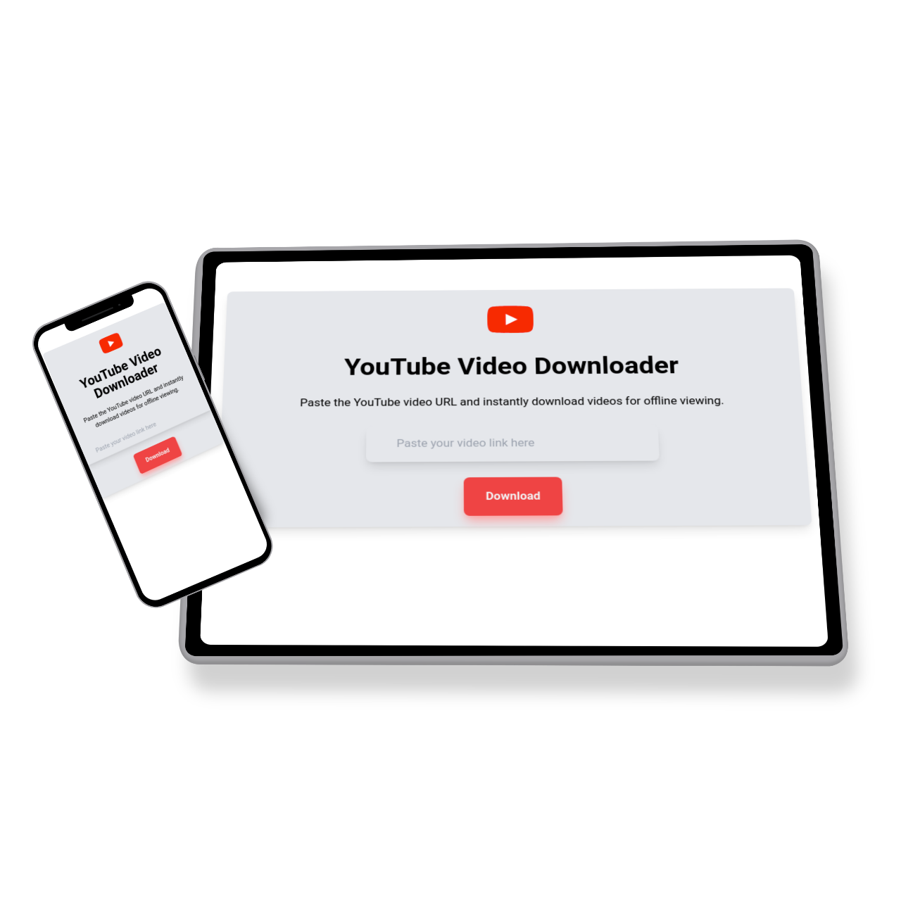
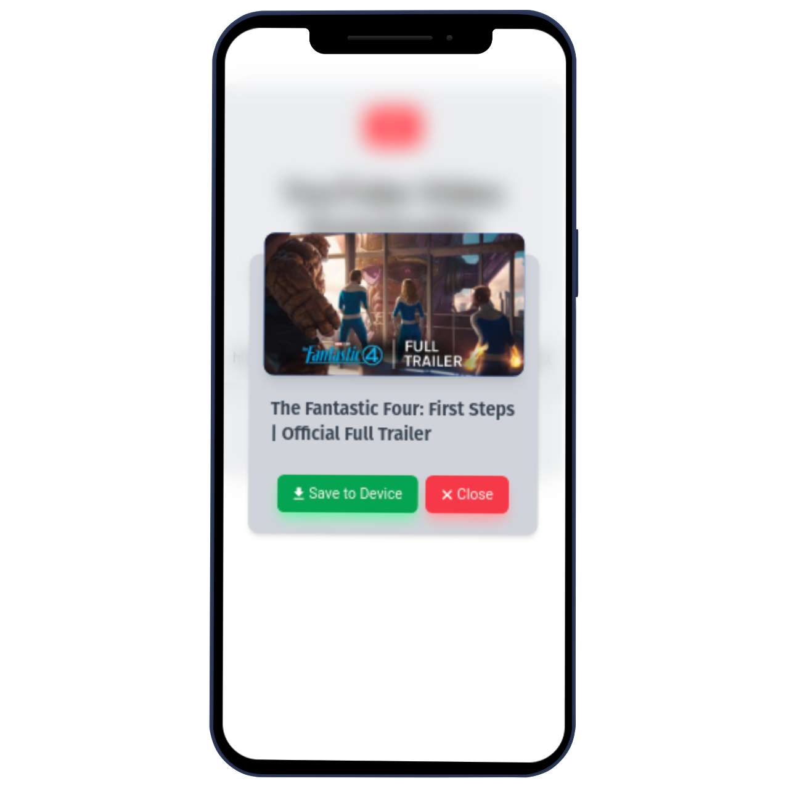
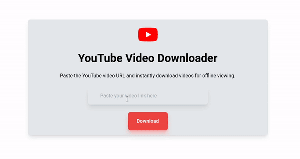

# Youtube Downloader

#### YouTube Downloader is a web application that allows you to download videos from YouTube easily. This repository contains both the client-side and server-side code for the application.

## Desktop View

<table>
<tr align='center'>
<td>Responsive view</td>
<td></td>
<td></td>
</tr>
<tr>
<td>Video Demo</td>
<td colspan="3"></img></td>
</tr>
</table>

## Table of Contents

- [Features](#features)
- [Tech Stack](#tech-stack)
- [Getting Started](#getting-started)
  - [Client Side](#client-side)
  - [Server Side](#server-side)
- [Contributors](#contributors)

## Features

- Download videos from YouTube by providing a URL.
- View and manage downloaded videos.
- Responsive design for both desktop and mobile devices.
- Error handling and user-friendly messages.
- Video title and thumbnail extraction.

## Tech Stack

### Server Side

- **FastAPI**: Web framework for building APIs.
- **yt-dlp**: A command-line program to download videos from YouTube.
- **uvicorn**: ASGI server implementation for FastAPI.
- **Python**: The programming language used.

### Client Side

- **React**: JavaScript library for building user interfaces.
- **Axios**: Promise-based HTTP client for making requests.
- **Neumorphism-UI**: Designed css with custom neumorphism ui concept.
- **Tailwind CSS**: Utility-first CSS framework.
- **Vite**: Next generation front-end tooling.

## Getting Started

### Client Side

To run the client-side of the application, follow these steps:

1. Clone the repository to your local machine:

   ```bash
   git clone https://github.com/rashedsabbir/youtube-downloader.git
   ```

2. Navigate to the client-side directory:

   ```bash
   cd client-side
   ```

3. Install dependencies:

   ```bash
   npm install
   ```

4. Start the development server:

   ```bash
   npm run dev
   ```

5. The client-side will be available at <code>[http://localhost:5173](http://localhost:5173)</code>.

### Server Side

The server-side of the application is built using FastAPI. You can run it as follows:

1. Create a virtual environment:

   ```bash
   python -m venv env
   ```

2. Activate the environment:

   - On Windows:

     ```bash
     .\env\Scripts\activate
     ```

   - On macOS/Linux:

     ```bash
     source env/bin/activate
     ```

3. Install the requirements:

   ```bash
   pip install -r requirements.txt
   ```

4. Navigate to the directory:

   ```bash
   cd server-side
   ```

5. Start the FastAPI server:

   ```bash
   uvicorn main:app --reload
   ```

6. The server will be available at <code>[http://localhost:8000](http://localhost:8000)</code>.

## Contributors

This project is maintained by the following contributors:

<table>
    <tr align='center'>
        <td>Mushfiqur Rahman Robin</td>
        <td>Rashedul Hassan Sabbir</td>
    </tr>
    <tr align='center'>
    <td><a href="https://www.linkedin.com/in/mushfiqur--rahman/" target="blank"></a> <a
    href="https://github.com/Mushfiqur-Rahman-Robin" target="blank"></a></td>
    <td><a href="https://linkedin.com/in/rashedsabbir" target="blank"></a> <a
    href="https://github.com/rashedsabbir" target="blank"></a></td>
    </tr>
</table>
